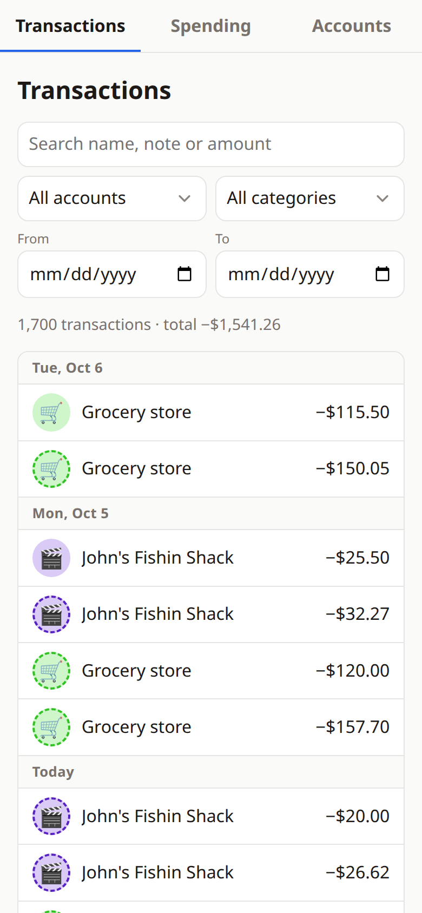
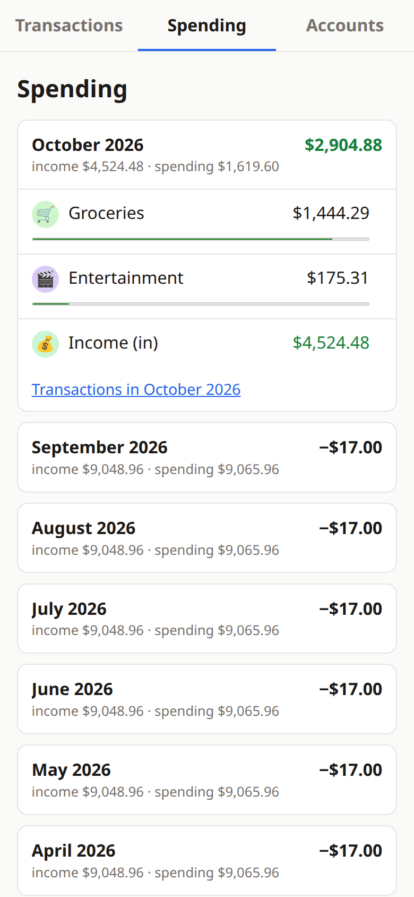
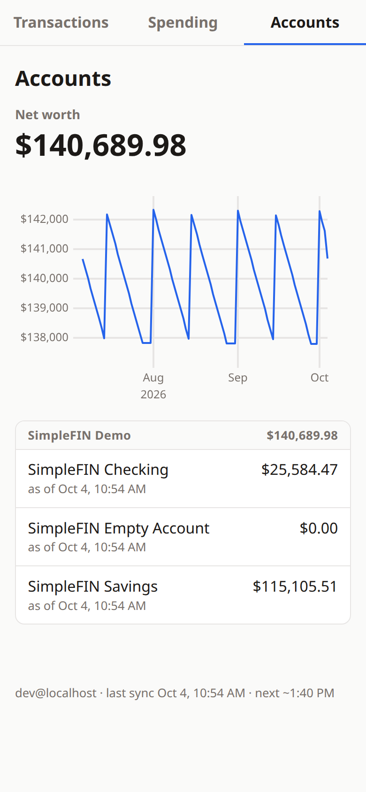

# BB: personal finance on your own server

A small, single-user finance app: your bank data, pulled through
[SimpleFIN Bridge](https://beta-bridge.simplefin.org) into your own Postgres,
with a phone-friendly web UI behind Cloudflare Access.

<p>
  
  
  
</p>

*(Screenshots use SimpleFIN's public demo data.)*

- **Transactions:** search by name, note or amount; filter by account, category
  and dates. Tap a category chip to change it; similar transactions follow,
  favoring your most recent choices. Rename a transaction by giving it a note.
- **Spending:** net income per month, broken down by category; each row opens
  that month's transactions.
- **Accounts:** net worth, its history, and balances by institution, including
  balances you keep by hand (like your home's value).
- **Sync:** every 3 hours from SimpleFIN, with history backfill, pending
  transactions, transfer detection between your own accounts, and joint
  accounts reported by two logins shown once.

## How it fits together

```
your banks ─▶ SimpleFIN Bridge ─HTTPS─▶ sync ─▶ Postgres ◀─ web ◀─socket─ cloudflared ◀─tunnel─ Cloudflare Access ◀─ you
                                       └──────────── one small VPS (Docker) ────────────┘
```

Nothing on the server listens on the internet: the web UI and SSH both come in
through a Cloudflare Tunnel, which only connects outward.

## Security model

- **Read-only data source.** SimpleFIN can't move money; bank logins live at
  SimpleFIN Bridge, never here.
- **The access URL is the crown jewel.** Only the `sync` container gets it, as
  a Docker secret file; it's never in URLs, logs or errors (tested).
- **Three locks on the web UI.** Cloudflare Access checks your login at the
  edge, cloudflared checks the Access token again on the server, and the app
  verifies it a third time (signature, audience, expiry, email allowlist)
  against Cloudflare's signing keys.
- **Least-privilege database roles:**

  | role | can |
  |---|---|
  | `finance_owner` | schema migrations only (`migrate` container) |
  | `finance_sync`  | write bank-sourced columns; **cannot** touch categories, notes or user flags (it may run `categorize()`) |
  | `finance_web`   | read-only; may `SET ROLE finance_edit` for edits, but doesn't inherit it |
  | `finance_edit`  | no login. The UI's edits: category, transfer flag and note only |
  | `finance_categorizer` | no login. Owns `categorize()` and the categorization history trigger |

- **Network.** Postgres and the web app sit on an internal Docker network with
  no route out and no published ports; the web app serves a Unix socket that
  cloudflared connects to. Only `sync` can reach the internet.
- **Containers:** distroless, non-root, read-only filesystem, all capabilities
  dropped. Images are built from a commit on your workstation and copied over
  SSH; the only image the server pulls is a digest-pinned Postgres.
- **Web:** server-rendered, no third-party scripts or CDNs, a strict
  Content-Security-Policy, `Cache-Control: no-store`, cross-site POSTs refused.
- **Secrets and personal values** live in 1Password; `env/*.env` hold only
  `op://` references. A gitleaks pre-commit hook blocks accidental commits.

## Set it up: one way to do it

This is how I run it: **SimpleFIN Bridge** for bank data, a **DigitalOcean**
droplet, **Cloudflare** for the domain, tunnel and login, and **1Password**
for secrets. Each piece can be swapped; the notes below say what's involved.

Rough running cost: SimpleFIN Bridge about $15/year, a 1 GB droplet about
$6/month (plus 20% for backups), a domain about $10/year. Cloudflare Zero Trust
is free for one user.

### 1. What you need

- A workstation (Linux or macOS) with Go 1.27+ (an older Go fetches it), Docker
  (rootless works), the [1Password CLI](https://developer.1password.com/docs/cli/)
  `op`, [`cloudflared`](https://developers.cloudflare.com/cloudflare-one/connections/connect-networks/downloads/),
  `gitleaks`, and SSH.
- Accounts: SimpleFIN Bridge, Cloudflare (with a domain), DigitalOcean (or any
  Ubuntu 24.04 server), 1Password.

### 2. Fork it and make it yours

These values are mine; replace them with yours:

| what | where |
|---|---|
| your Cloudflare team | `brookshear` in `deploy/cloudflared/config.yml`, `compose.prod.yaml` (`ACCESS_TEAM_DOMAIN`), `deploy/finance/finance-access-keys.service` |
| your hostnames (`ssh.` and `finance.` your domain) | `deploy/cloudflared/config.yml` |
| tunnel ID and Access AUD tags | `deploy/cloudflared/config.yml`, `compose.prod.yaml` (filled in during step 6) |
| your time zone | `America/Los_Angeles` in `compose.yaml` and `deploy/finance/finance-sync.timer` |
| the server's admin user | `ADMIN_USER` when you run `scripts/bootstrap-droplet.sh` (default `cody`), and `User` in your SSH config |
| the 1Password vault name | `Finance App` in `env/*.env` and `scripts/*.sh` |

Then `make setup` (installs the pre-commit hook) and `make test` (unit and
integration tests against a throwaway Postgres in Docker).

### 3. 1Password

Make a vault (mine is "Finance App"). The scripts create the items, so values
never appear on screen or on a command line:

| item | made by | holds |
|---|---|---|
| `finance-dev-db`, `finance-prod-db` | `scripts/db-passwords-create.sh <item>` | the three database role passwords |
| `simplefin-demo` | `make demo-claim` | SimpleFIN's public demo access URL |
| `simplefin` | `make claim` | your real SimpleFIN access URL |
| `cloudflared-tunnel` | `scripts/tunnel-create.sh` | the tunnel's credentials |
| `finance-prod-config` | `scripts/prod-config-create.sh` | manual balances (JSON) and the email(s) allowed in |

Also keep your server's sudo password there. Another secret manager works if
you replace the `op read` / `op item create` calls in `scripts/` and the
`op://` references in `env/*.env`.

### 4. Try it locally with demo data

```sh
eval "$(op signin)"                               # a 1Password CLI session for this shell
scripts/db-passwords-create.sh finance-dev-db
make demo-claim                                   # SimpleFIN's demo data
make dev                                          # Postgres, migrations, one sync, the web UI
```

The UI is on port 8080 of your machine, without the Cloudflare login (it's
development only, with demo data). `WEB_DEV_BIND=127.0.0.1 make dev` keeps it
off your LAN.

### 5. SimpleFIN Bridge

Sign up at SimpleFIN Bridge, turn on 2FA, and connect your banks there (they
use MX behind the scenes; bank logins stay with them). When you're ready to
deploy, create a **setup token** in Bridge and claim it:

```sh
make claim        # prompts for the token; the access URL goes straight to 1Password
```

Setup tokens are single-use, and whoever claims one first can read your
accounts: don't paste it anywhere else. If the access URL ever leaks, revoke
the app in Bridge and claim a new token. Bridge refreshes from banks about
once a day and asks apps to stay under roughly 24 requests a day; the sync
stays within that.

### 6. A server (DigitalOcean, roughly)

- **Droplet:** Ubuntu 24.04, 1 GB RAM is plenty, your SSH key.
  Turn on backups: the database is the one thing you can't recreate.
- **Cloud Firewall:** inbound SSH from your IP only, for now; outbound open.
  Once the tunnel works, remove the SSH rule so there's no inbound access at all.
- **Bootstrap**, once, as root: OS updates and automatic security updates, an
  admin user with a sudo password, hardened SSH, ufw, Docker and cloudflared
  from their signed repos:

  ```sh
  scp scripts/bootstrap-droplet.sh root@<droplet-ip>:
  ssh -t root@<droplet-ip> 'ADMIN_USER=<you> bash bootstrap-droplet.sh'
  ```

Any Ubuntu 24.04 machine with systemd works the same way (another cloud, a VM
at home). On another distribution, `bootstrap-droplet.sh` is the part to adapt.

### 7. Cloudflare: domain, login, tunnel

1. **Domain:** register one with Cloudflare Registrar (simplest: it's on
   Cloudflare immediately) or point your domain's nameservers at Cloudflare.
2. **Zero Trust** (free plan): pick a team name (`<team>.cloudflareaccess.com`)
   and a login method: email one-time PIN works; an identity provider protected
   by a passkey is stronger.
3. **Access applications**, one per hostname: `ssh.<domain>` and
   `finance.<domain>`, each with an Allow policy for your email.
4. **The tunnel and SSH:** follow [deploy/cloudflared/README.md](deploy/cloudflared/README.md).
   `scripts/tunnel-create.sh` creates the tunnel and stores its credentials in
   1Password; `scripts/tunnel-deploy.sh` installs it on the server. After
   that, `ssh finance` goes through Cloudflare, and you close port 22.
5. **The web hostname:** a proxied DNS CNAME `finance` →
   `<tunnel-id>.cfargotunnel.com`, and its Access app's AUD tag in
   `deploy/cloudflared/config.yml` and `compose.prod.yaml` (commit it). The
   tunnel starts serving it in the next step.

Without Cloudflare: Tailscale or WireGuard can replace the tunnel for SSH, but
the web app expects Cloudflare Access tokens on every request. `WEB_DEV_EMAIL`
turns that off and is for local development only, so another front door needs
its own login check in the app.

### 8. Deploy

```sh
eval "$(op signin)"
scripts/db-passwords-create.sh finance-prod-db
scripts/prod-config-create.sh deploy/finance/manual-accounts.example.json you@example.com   # edit the JSON first, or use []
scripts/deploy.sh            # builds from your latest commit, ships it, runs a first sync
scripts/tunnel-deploy.sh finance   # the tunnel now serves finance.<domain> too
```

`deploy.sh` asks for the server's sudo password once. It installs the stack
under `/opt/finance`, a timer that syncs every 3 hours, and a timer that keeps
Cloudflare's signing keys fresh, then checks the web app refuses requests
without a login. Details and day-to-day commands:
[deploy/finance/README.md](deploy/finance/README.md).

### 9. Day to day

- **Categorize:** tap a transaction's chip. Similar transactions are guessed
  from your choices (dashed chips); picking a guessed category confirms it.
- **Balances kept by hand** (home value, a 401(k) SimpleFIN can't reach): edit
  `manual_accounts` in the `finance-prod-config` item (format:
  [deploy/finance/manual-accounts.example.json](deploy/finance/manual-accounts.example.json);
  a debt is negative), then `scripts/deploy.sh`.
- **Updates:** commit, then `scripts/deploy.sh`.

## Development

```
cmd/sync, cmd/migrate, cmd/web   the three programs (one image each)
internal/simplefin   credential-safe SimpleFIN client
internal/syncer      incremental sync, backfill, manual balances
internal/store       Postgres access for the sync, migration runner
internal/web         the UI: handlers, templates, Access verification
internal/manual      balances kept by hand
migrations/          SQL schema, grants and functions (embedded in migrate)
db/init/             creates the app roles on first database start
deploy/              cloudflared and server configs, with runbooks
scripts/             bootstrap, tunnel, deploy, and 1Password helpers
```

`make test` runs everything, including database tests that prove each role's
grants are enough, and no more. `make dev` runs the stack locally.

## How sync works

Each run: one incremental fetch (last success − 5 days → now, including
pending) that also records each account's balance for today, then up to 2
backfill requests walking back in 45-day windows (SimpleFIN's recommended
maximum) until two windows come back empty or 3 years is reached. A newly
connected account restarts the backfill.

- Pending transactions that disappear (posted under a new ID, or voided) are removed.
- Balance history only exists from the first sync onward, so deploy sync early.
- Categories, notes and transfer flags you set are never overwritten by the
  sync, which is enforced by column-level grants, not just code.

## License

[MIT](LICENSE)
